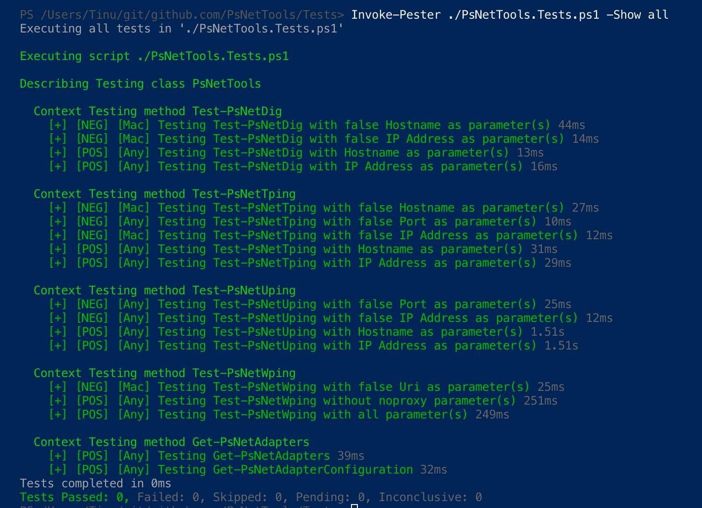

# Table of Contents

- [Table of Contents](#table-of-contents)
- [PsNetTools](#psnettools)
- [Test-PsNetDig](#test-psnetdig)
- [Test-PsNetTping](#test-psnettping)
- [Test-PsNetUping](#test-psnetuping)
- [Test-PsNetWping](#test-psnetwping)
- [Get-PsNetAdapters](#get-psnetadapters)
- [Get-PsNetAdapterConfiguration](#get-psnetadapterconfiguration)
- [Get-PsNetRoutingTable](#get-psnetroutingtable)
- [Get-PsNetHostsTable](#get-psnethoststable)
- [Add-PsNetHostsEntry](#add-psnethostsentry)
- [Remove-PsNetHostsEntry](#remove-psnethostsentry)
- [How to Export settings](#how-to-export-settings)
- [Who is behind an URI](#who-is-behind-an-uri)

# PsNetTools

PsNetTools is a cross platform PowerShell module to test some network features on Windows and Mac.  



Image generated with [PSWordCloud](https://github.com/vexx32/PSWordCloud) by Joel Sallow.

Import Module:  

````powershell
Import-Module .\PsNetTools.psd1 -Force
````

List all ExportedCommands:  

````powershell
Get-Command -Module PsNetTools

CommandType     Name                                               Version    Source
-----------     ----                                               -------    ------
Function        Add-PsNetHostsEntry                                0.3.5      PsNetTools
Function        Get-PsNetAdapterConfiguration                      0.3.5      PsNetTools
Function        Get-PsNetAdapters                                  0.3.5      PsNetTools
Function        Get-PsNetHostsTable                                0.3.5      PsNetTools
Function        Get-PsNetRoutingTable                              0.3.5      PsNetTools
Function        Remove-PsNetHostsEntry                             0.3.5      PsNetTools
Function        Test-PsNetDig                                      0.3.5      PsNetTools
Function        Test-PsNetTping                                    0.3.5      PsNetTools
Function        Test-PsNetUping                                    0.3.5      PsNetTools
Function        Test-PsNetWping                                    0.3.5      PsNetTools
````

# Test-PsNetDig

Test-PsNetDig - domain information groper.  
Resolves a hostname to the IP addresses or an IP Address to the hostname.  

Test-PsNetDig -Destination

- Destination: Hostname or IP Address or Alias or WebUrl

````powershell
Test-PsNetDig -Destination 'sbb.ch' | Format-List

TargetName  : sbb.ch
IpV4Address : 194.150.245.142
IpV6Address : 2a00:4bc0:ffff:ffff::c296:f58e
Duration    : 4ms
````

# Test-PsNetTping

Test-PsNetTping - tcp port scanner.  
It's like the cmdlet Test-NetConnection, but with the ability to specify a timeout in ms.  

Test-PsNetTping -Destination -TcpPort [-MinTimeout] [-MaxTimeout]

- Destination: Hostname or IP Address or Alias or WebUrl
- TcpPort:     Tcp Port to use
- MinTimeout:  Timeout in ms (optional, default is 0ms)
- MaxTimeout:  Timeout in ms (optional, default is 1000ms)

````powershell
Test-PsNetTping -Destination 'sbb.ch' -TcpPort 443

TargetName   : sbb.ch
TcpPort      : 443
TcpSucceeded : True
Duration     : 22ms
MinTimeout   : 0ms
MaxTimeout   : 1000ms
````

# Test-PsNetUping

Test-PsNetUping - udp port scanner.  
It's like the cmdlet Test-NetConnection, but with the ability to specify a timeout in ms and query for udp.  

Test-PsNetTping -Destination -UdpPort [-MinTimeout] [-MaxTimeout]

- Destination: Hostname or IP Address or Alias or WebUrl
- UdpPort:     Udp Port to use
- MinTimeout:  Timeout in ms (optional, default is 0ms)
- MaxTimeout:  Timeout in ms (optional, default is 1000ms)

````powershell
Test-PsNetUping -Destination 'sbb.ch' -UdpPort 53

TargetName   : sbb.ch
UdpPort      : 53
UdpSucceeded : False
Duration     : 103ms
MinTimeout   : 0ms
MaxTimeout   : 1000ms
````

# Test-PsNetWping

Test-PsNetWping - http web request scanner.  
It's like the cmdlet Invoke-WebRequest, but with the ability to specify 'noproxy' with PowerShell 5.1.  

Test-PsNetWping -Destination [-MinTimeout] [-MaxTimeout] [-NoProxy]

- Destination: WebUri
- MinTimeout:  Timeout in ms (optional, default is 0ms)
- MaxTimeout:  Timeout in ms (optional, default is 1000ms)
- NoProxy:     Switch (optional)

````powershell
Test-PsNetWping -Destination 'https://sbb.ch' -NoProxy

TargetName  : https://sbb.ch
ResponseUri : https://www.sbb.ch/de/
StatusCode  : OK
Duration    : 231ms
MinTimeout   : 0ms
MaxTimeout   : 1000ms
````

# Get-PsNetAdapters

Get-PsNetAdapters -get the network interface for all adapters.  

````powershell
Get-PsNetAdapters | Where-Object Index -eq 11

Succeeded            : True
Index                : 11
Id                   : {<GUID>}
Name                 : Wi-Fi or Ethernet or Wwanpp or Wireless80211
Description          : Intel(R) Dual Band Wireless-AC 8265
NetworkInterfaceType : Wireless80211
OperationalStatus    : Up or Down
Speed                : 866700000
IsReceiveOnly        : False or True
SupportsMulticast    : True or False
IpVersion            : {IPv4, IPv6}
````

# Get-PsNetAdapterConfiguration

Get-PsNetAdapterConfiguration - get the network interface configuration for all adapters.  

````powershell
Get-PsNetAdapterConfiguration | Where-Object Index -eq 11

Succeeded            : True
Index                : 11
Id                   : {<GUID>}
Name                 : Wi-Fi or Ethernet or Wwanpp or Wireless80211
Description          : Intel(R) Dual Band Wireless-AC 8265
NetworkInterfaceType : Wireless80211
OperationalStatus    : Up or Down
Speed                : 866700000
IsReceiveOnly        : False or True
SupportsMulticast    : True or False
IpVersion            : {IPv4, IPv6}
IpV4Addresses        : {<IP Address V4>}
IpV6Addresses        : {<IP Address V6>}
PhysicalAddres       : MAC Address
IsDnsEnabled         : False or True
IsDynamicDnsEnabled  : True or False
DnsSuffix            : <DNS Suffix>
DnsAddresses         : {<IP Address V4>}
Mtu                  : False or True
IsForwardingEnabled  : True or False
IsAPIPAEnabled       : False or True
IsAPIPAActive        : True or False
IsDhcpEnabled        : True or False
DhcpServerAddresses  : {<IP Address V4>}
UsesWins             : False or True
WinsServersAddresses : {<IP Address V4>}
GatewayIpV4Addresses : {<IP Address V4>}
GatewayIpV6Addresses : {<IP Address V6>}
````

# Get-PsNetRoutingTable

Get-PsNetRoutingTable - Get Routing Table
Format the Routing Table to an object.

Get-PsNetRoutingTable -IpVersion IPv4 or IPv6

````powershell
Get-PsNetRoutingTable -IpVersion IPv4 | Format-Table

Succeeded AddressFamily Destination     Netmask         Gateway     Interface     Metric
--------- ------------- -----------     -------         -------     ---------     ------
     True IPv4          0.0.0.0         0.0.0.0         10.29.191.1 10.29.191.zzz 45
     True IPv4          10.29.191.0     255.255.255.0   On-link     10.29.191.zzz 301
     True IPv4          10.29.191.zzz   255.255.255.255 On-link     10.29.191.zzz 301
     True IPv4          10.29.191.zzz   255.255.255.255 On-link     10.29.191.zzz 301
     True IPv4          127.0.0.0       255.0.0.0       On-link     127.0.0.1     331
     True IPv4          127.0.0.1       255.255.255.255 On-link     127.0.0.1     331
     True IPv4          127.255.255.255 255.255.255.255 On-link     127.0.0.1     331
     True IPv4          224.0.0.0       240.0.0.0       On-link     127.0.0.1     331
     True IPv4          224.0.0.0       240.0.0.0       On-link     10.29.191.zzz 301
     True IPv4          255.255.255.255 255.255.255.255 On-link     127.0.0.1     331
     True IPv4          255.255.255.255 255.255.255.255 On-link     10.29.191.zzz 301
````

# Get-PsNetHostsTable

Get-PsNetHostsTable - Get hostsfile
Format the hostsfile to an object.

Get-PsNetHostsTable

````powershell
Get-PsNetHostsTable

Succeeded IpAddress    Compuername FullyQualifiedName
--------- ---------    ----------- ------------------
     True 192.168.1.27 computer1   computername1.fqdn
     True 192.168.1.28 computer2
     True 192.168.1.29 computer3   computername3.fqdn
````

# Add-PsNetHostsEntry

**WARNING:** Running this command with elevated privilege.

Add-PsNetHostsEntry - Add an entry in the hosts-file  
This Function create a backup for the hostsfile before overrite it. If the content is empty, the backup-file will be restored automatically.

Add-PsNetHostsEntry -IPAddress -Hostname -FullyQualifiedName

- IPAddress:          IP Address to add  
- Hostname:           Hostname to add  
- FullyQualifiedName: FullyQualifiedName to add  

````powershell
Add-PsNetHostsEntry -IPAddress '127.0.0.1' -Hostname tinu -FullyQualifiedName tinu.walther.ch

Succeeded     : True
Message       : Entry added
Entry         : 127.0.0.1 tinu tinu.walther.ch
BackupSavedAt : C:\Users\YourAccount\AppData\Local\Temp\hosts_20190210-150950.txt
````

# Remove-PsNetHostsEntry

**WARNING:** Running this command with elevated privilege.

Remove-PsNetHostsEntry - Remove an entry in the hosts-file  
This Function create a backup for the hostsfile before overrite it. If the content is empty, the backup-file will be restored automatically.

Remove-PsNetHostsEntry -IPAddress

- IPAddress: IP Address to remove  

````powershell
Remove-PsNetHostsEntry -IPAddress 127.0.0.1

Succeeded     : True
Message       : Entry removed
Entry         : 127.0.0.1 tinu tinu.walther.ch
BackupSavedAt : C:\Users\YourAccount\AppData\Local\Temp\hosts_20190210-151244.txt
````

# How to Export settings

You can easy export all the output of the commands as a JSON-file with the following CmdLets:

- ConvertTo-JSON
- Set-Content

As an example run Test-PsNetDig:

````powershell
Test-PsNetDig sbb.ch

Succeeded   : True
TargetName  : sbb.ch
IpV4Address : 194.150.245.142
IpV6Address :
Duration    : 61ms
````

Convert the result from Test-PsNetDig to a JSON-Object:

````powershell
Test-PsNetDig sbb.ch | ConvertTo-Json

{
    "Succeeded":  true,
    "TargetName":  "sbb.ch",
    "IpV4Address":  "194.150.245.142",
    "IpV6Address":  null,
    "Duration":  "0ms"
}
````

Export the JSON-Object from Test-PsNetDig to a file:

````powershell
Test-PsNetDig sbb.ch | ConvertTo-Json | Set-Content D:\PsNetDig.json
````

# Who is behind an URI

Test the correct URI for http://google.com

````powershell
Test-PsNetWping -Destination http://google.com -Timeout 1000

Succeeded   : True
TargetName  : http://google.com
ResponseUri : http://www.google.com/
StatusCode  : OK
Duration    : 204ms
MaxTimeout  : 1000ms
````

[ [Top] ](#table-of-contents)